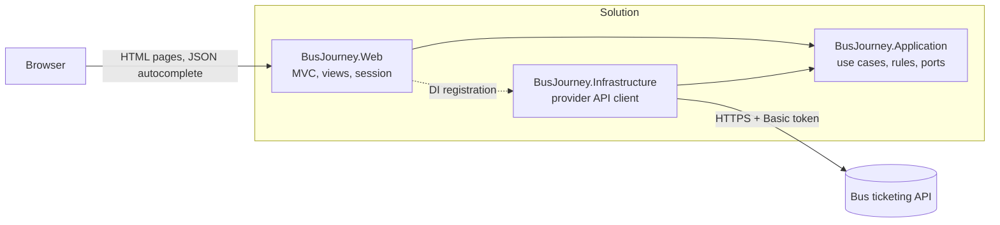
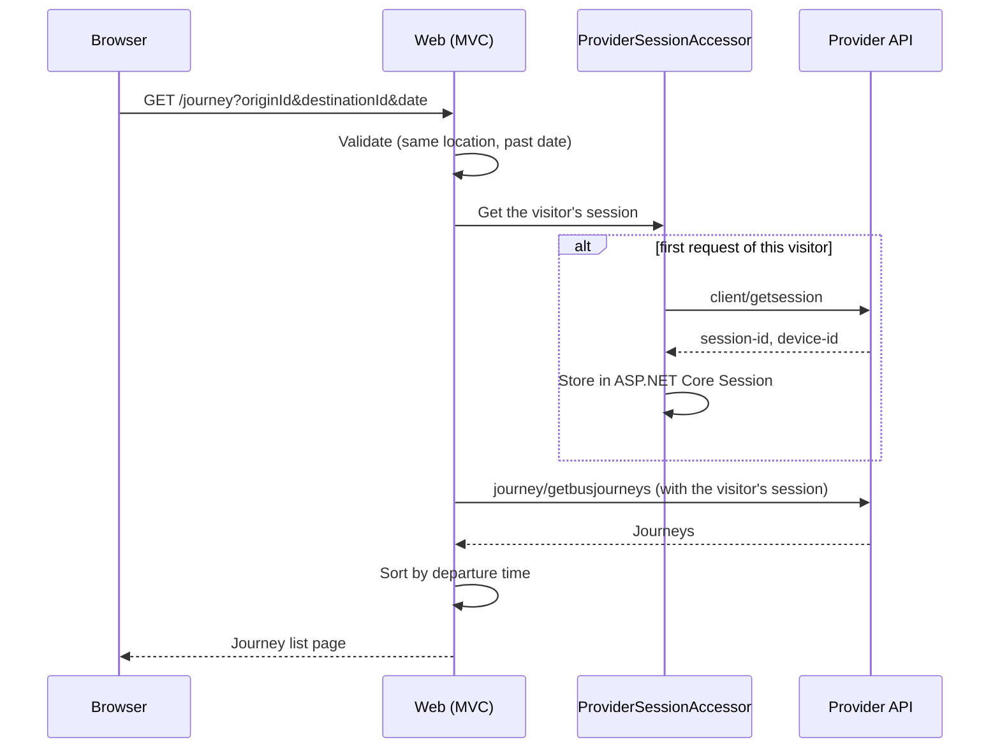

# Bus Journey Search

An ASP.NET Core MVC application for searching intercity bus journeys. Users pick an origin, a destination
and a departure date, and get every journey for that day, sorted by departure time. All data comes live
from an external bus ticketing API.


> [!IMPORTANT]
> **Before running:** the API base URL and client token are intentionally not committed. Set them once with
> the two `dotnet user-secrets` commands in [Configure secrets](#configure-secrets), using the values from
> the assignment documents. The application does not start without them.

## Contents

- [Features](#features)
- [Getting started](#getting-started)
- [Architecture](#architecture)
- [Design decisions](#design-decisions)
- [Notes on the provider API](#notes-on-the-provider-api)
- [Testing](#testing)
- [Known limitations](#known-limitations)

## Features

### Search page

- Origin and destination fields with **live search**. Suggestions are fetched from the backend as you type
  (debounced, stale requests cancelled). Arrow keys, Enter and Esc work, and the fields follow the WAI-ARIA
  combobox pattern.
- A location picked on one side is **shown as unavailable** in the other side's suggestions, so origin and
  destination cannot be the same.
- **Swap** button for origin and destination.
- Date field with **previous / next day arrows** and a **Today / Tomorrow** switch. The previous-day arrow is
  disabled on today, because past dates cannot be searched.
- **Defaults**: the first two locations in the API's own order, and tomorrow's date.
- **Last search is remembered** in `localStorage` and restored on the next visit. A remembered date that is
  already in the past falls back to tomorrow.
- **Validation** (same location, past date) runs in the browser for instant feedback and again on the server.
- **Loading screen** while journeys are being fetched, with a smooth transition to the results page.

### Journey list

- Journeys **sorted by departure time**, each with departure → arrival, duration, stations, bus company and
  price.
- Journeys leaving after midnight are separated by a note, e.g. *"Aşağıdaki seferler Pazar'ı Pazartesi'ye
  bağlayan gece gerçekleşecektir."*
- **Back to top** button on long lists.
- Clear empty and error states.

### Across the app

- **Responsive**: a horizontal search bar on desktop, a stacked layout on phones.
- **Per-visitor API session**: every visitor gets their own session with the provider, created on first use
  and reused for all of that visitor's requests.
- **The browser never calls the provider API**: every provider call is made server side.
- Per-IP **rate limiting**, **security headers** (`X-Content-Type-Options`, `X-Frame-Options`,
  `Referrer-Policy`) and an `HttpOnly` + `Secure` session cookie.

## Getting started

### Prerequisites

- [.NET 8 SDK](https://dotnet.microsoft.com/download/dotnet/8.0). The version is pinned in `global.json`.
- The provider API base URL and client token (provided with the assignment).

### Configure secrets

The API address and token are **not stored in the repository**, because a client token does not belong in
source control. Set them once per machine with
[user-secrets](https://learn.microsoft.com/aspnet/core/security/app-secrets):

```bash
cd src/BusJourney.Web
dotnet user-secrets set "Provider:BaseUrl" "https://<api-host>/api"
dotnet user-secrets set "Provider:ApiClientToken" "<api-client-token>"
```

| Setting | Where to find it |
| --- | --- |
| `Provider:BaseUrl` | The API endpoint in the integration document, up to and including `/api` (the Postman collection uses the same address) |
| `Provider:ApiClientToken` | `ApiClientToken` in the assignment document, without the `Basic ` prefix |

The values are stored in your user profile, outside the project folder, so they never end up in git.
In other environments, use environment variables instead: `Provider__BaseUrl` and `Provider__ApiClientToken`.
If either value is missing, the application stops at startup with a clear validation error.

### Run

```bash
cd src/BusJourney.Web
dotnet run --launch-profile https
```

Then open <https://localhost:7039>. If the browser warns about the certificate, run
`dotnet dev-certs https --trust` once.

### Test

```bash
dotnet test
```

## Architecture

The solution has three layers plus a test project. Dependencies point inwards: the Application layer knows
nothing about HTTP, ASP.NET or the provider's JSON format.



```text
src/
  BusJourney.Application/     Models, services, validation, and the ports the other layers implement
  BusJourney.Infrastructure/  Typed HttpClient, request/response envelopes, JSON contracts, DTO mapping
  BusJourney.Web/             Controllers, Razor views, session store, filters, static assets (CSS/JS)
tests/
  BusJourney.Tests/           xUnit tests for rules, services, the API client and formatting
```

### Ports

| Port (Application) | Implemented in | Responsibility |
| --- | --- | --- |
| `IBusProviderClient` | `Infrastructure/Provider/BusProviderClient` | Create session, get locations, get journeys |
| `IProviderSessionStore` | `Web/Session/HttpSessionProviderSessionStore` | Keep the current visitor's provider session |

### Routes

| Route | Controller | Returns |
| --- | --- | --- |
| `GET /` | `HomeController.Index` | Search page |
| `GET /locations?q=` | `LocationsController.Search` | JSON for the autocomplete |
| `GET /journey?originId=&destinationId=&date=yyyy-MM-dd` | `JourneyController.Index` | Journey list (shareable URL) |

### A search, end to end



## Design decisions

- **Session per visitor.** `ProviderSessionAccessor` creates the provider session lazily and stores it in
  ASP.NET Core Session (cookie + `IDistributedCache`). The cache is in memory here; switching to Redis for
  multiple servers only changes the DI registration.
- **Typed `HttpClient`** via `IHttpClientFactory`. Base address, timeout and the `Basic` auth header are
  configured once at registration, not on every call.
- **One exception type for every provider failure.** A non-success status, an HTTP error, a timeout or
  malformed JSON all become `ProviderException`. `ProviderExceptionFilter` turns it into a user-friendly page,
  or into `ProblemDetails` for JSON requests.
- **Validation has one source of truth**: `JourneyQueryValidator` on the server. The JavaScript copy only
  gives instant feedback.
- **Time zone.** "Today" is always evaluated in Turkish time, independent of the server's time zone.
  `TimeProvider` is injected, so tests can pin the clock.
- **Frontend without a framework.** Bootstrap provides the base styles. Behaviour lives in small ES modules:
  `location-autocomplete.js` (a reusable combobox), `search-form.js` and `back-to-top.js`. Page transitions
  use the browser's native View Transitions, and browsers without support simply navigate normally.
- **Secrets never in source control.** The token and base URL come from user-secrets or environment
  variables, and are validated at startup (`ValidateOnStart`).

## Notes on the provider API

- The documented `GetSession` body (`type: 7` + `application`) is rejected by the live API with
  `Port can not be null for browsers`. The body from the sample Postman collection (`type: 1` +
  `connection.port` + `browser`) works and is the one used.
- The documentation is inconsistent about some numeric types (`id`, `internet-price`). The client accepts
  numbers both as JSON numbers and as strings.
- A search for a given date also returns journeys leaving between midnight and early morning of the next
  day. They are kept, sorted to the end, and labelled as night journeys.
- The provider applies an IP-based rate limit. Since every request without a session cookie creates a new
  provider session, this app also limits requests per client IP.

## Testing

`dotnet test` runs the xUnit suite. No test calls the real API: HTTP is replaced with a stub
`HttpMessageHandler`, and time with a fixed `TimeProvider`.

| Area | Covered |
| --- | --- |
| `JourneyQueryValidator` | Same location, yesterday / today / tomorrow, "today" in Turkish time |
| `LocationService` | Defaults follow the provider's order, tomorrow's date, unknown ids fall back |
| `JourneyService` | Sorting by departure, route names when there are no journeys |
| `ProviderSessionAccessor` | One session per visitor, reused across requests |
| `BusProviderClient` | Auth header, request envelope field names, response mapping, error statuses, bad JSON |
| `TurkishDayNames` | Night notice wording for all seven days |

### Manual checklist

1. Open `/`. Origin, destination and tomorrow's date are pre-filled.
2. Type in *Nereden*. Suggestions appear after a short pause. Arrow keys and Enter select, Esc closes.
3. Open *Nereye*. The city picked in *Nereden* is shown as unavailable.
4. Swap the locations. Use *Bugün* / *Yarın* and the day arrows; on today the previous-day arrow is disabled.
   Type a past date and search: an error is shown.
5. Click *Sefer ara*. A loading screen appears, then journeys listed by departure time.
6. On a long list, scroll down and use the back-to-top button. The back link returns to the search page.
7. Reload `/`. The last search is restored.

## Known limitations

- **Expired provider sessions** are not refreshed automatically. The API does not document which status it
  returns for an expired session, so there is no retry logic yet.
- **Suggestions on focus** show the first 10 locations. The full list is fetched from the API, and every other
  location is reachable by typing. Search results are not capped yet.
- The full location list is fetched on every load of the search page. Caching it in memory is a
  straightforward next step, because locations are the same for every visitor and rarely change.
